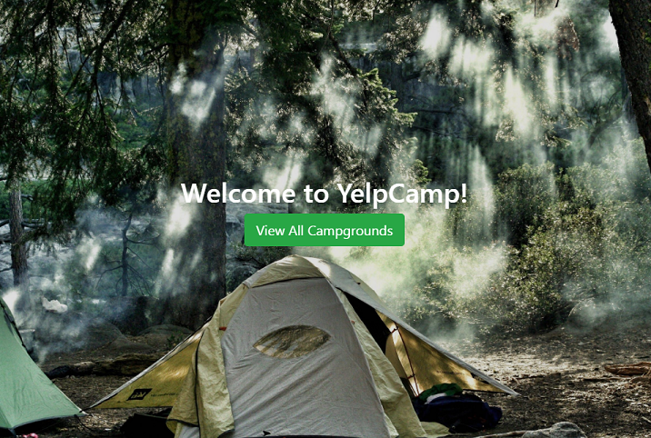

# YelpCamp
Final project for a Web Dev Bootcamp course.

### Purpose
Allows users to review and comment on campgrounds. Each user account can create, view, edit, and delete their own campgrounds and comments

### Features
* User account creation and authentication
* User sessions
* Full CRUD operations on both campgrounds and comments 
* RESTful routing architechure with protected routes
* Flash messages for error handling
* Dynamically displayed HTML using EJS

#### Note
Currently deployed on Heroku

